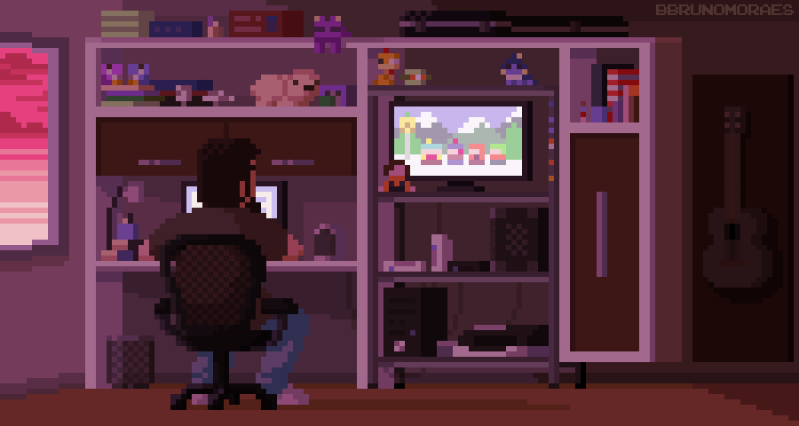

<!-- ### Hi there 👋-->

    <h1 align="left">👋 Hi, I'm <a href="https://www.linkedin.com/in/ayoub-hamdoun/" target="_blank"> Ayoub </a> </h1>
    

     Welcome to my GitHub profile! my name is Ayoub, a highly motivated and disciplined computer science student dedicated to building a career in full-stack development. Committed to continuous learning, I combine self-study with collaboration with my peers to refine my skills.

    I'm actively developing my personal website, serving as a testament to my journey towards becoming a skilled full-stack developer. Stay tuned for updates!

